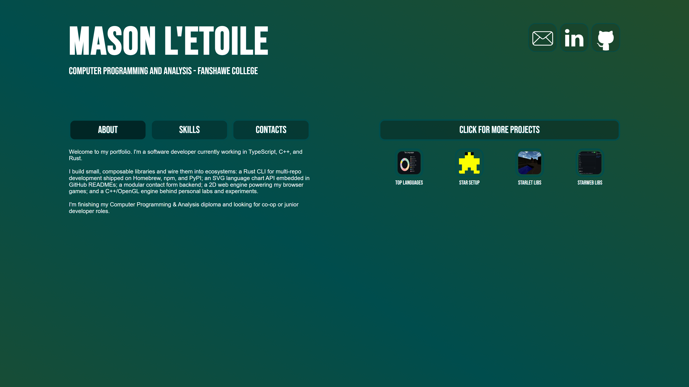

# Portfolio
Personal development portfolio showcasing my projects, skills, and contact information.




## Features
- Responsive design with HTML, CSS, and TypeScript.
- Integrated contact form.
- Project showcase with README fetching and description fallbacks, tech stacks, and GitHub links.
- Typewriter-style introduction

## 🔗 **Website**: 
- [**masonletoile.ca**](https://masonletoile.ca)
- [**masonletoile.com**](https://masonletoile.com)

## Tech Stack
<p align="left">
  
  
  
  
  
  
</p>

## Dependencies
The portfolio frontend is static — contact form submission and README fetching are offloaded to dedicated microservices, keeping the frontend decoupled and independently deployable.

- [contact-api](https://github.com/masonlet/contact-api) — Contact form microservice
- [readme-api](https://github.com/masonlet/readme-api) — GitHub README fetching microservice

## Deployment & Configuration

### Prerequisites

- npm
- Node.js 18+ (for local development and building only)

### 1. Clone the Repository

```bash
# Clone Portfolio
git clone https://github.com/masonlet/portfolio.git
cd portfolio

# Install and start
npm install
```

### Development

#### Run Locally

```bash
# Start development server
npm run dev
```

##### Open http://localhost:5173 (or the address shown in your terminal) in your browser.

#### Build for Production

```bash
# Build 
npm run build

# Preview production output locally
npm run preview
```

##### Open http://localhost:4173 (or the address shown in your terminal) in your browser.

### Deployment

The production build outputs static files to the `dist/` directory which can be hosted on any static hosting provider. Node.js is **not required** to run the deployed site.

## License
MIT License - see [LICENSE](./LICENSE) for details.
